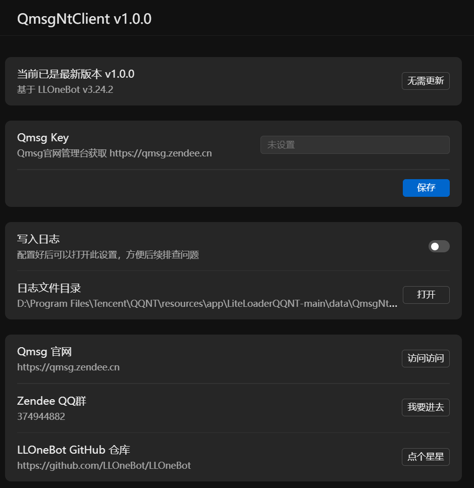

# Qmsg NT Client
适用于Windows/MacOS QQNT的Qmsg酱机器人客户端插件
> 基于LLOneBot
> https://github.com/LLOneBot/LLOneBot

插件运行环境基于`LiteLoaderQQNT`，支持Mac但是我没试过，因为我买不起Mac
## 安装Qmsg NT Client
https://qmsg.zendee.cn/docs/pvt
## Qmsg酱官网
https://qmsg.zendee.cn
## 我的万年不更新博客
https://www.zendee.cn
## 设置界面
此图并非最新版界面，请以安装后的界面为准

## Qmsg酱形象

